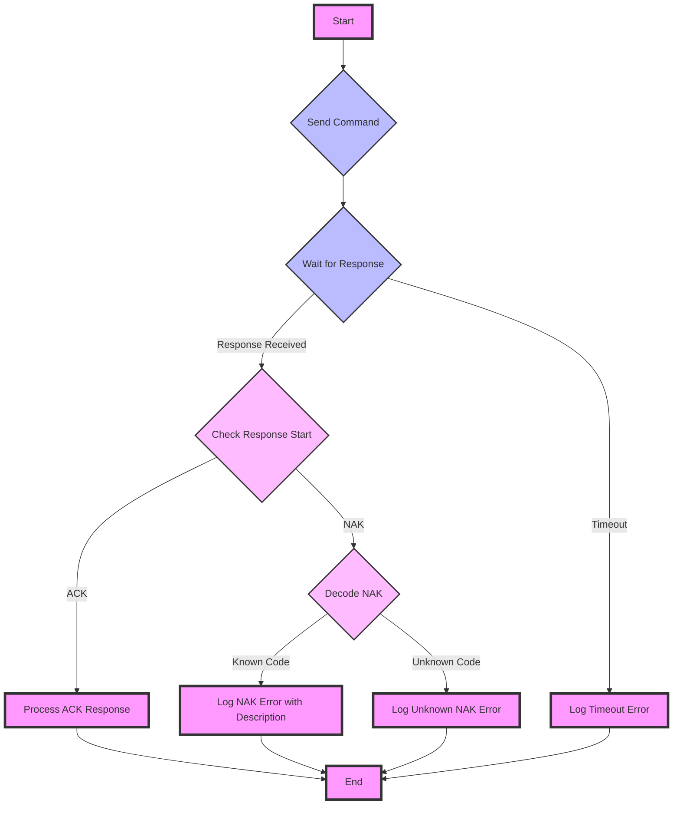

### Construct a sensor object
The `PressureTransducer` class is initialized with a constructor that sets up the device for communication.

`PressureTransducer::PressureTransducer(String addr, Stream& serial);`

Parameters:
 - `addr`: A String representing the device address. If an empty string is provided, a default address is used.
 - `serial`: A reference to a Stream object which represents the serial port used for communication with the transducer. 
The constructor initializes the device with the given address (or defaults to `253` one if not specified) and sets up the specified serial port for communication.

#### Usage
```c
#include <972b.h>

PressureTransducer sensor; // Instantiate 972b sensor object with default address "253"

void setup() {
    Serial.begin(9600);   // initialize PC COM interface
    Serial2.begin(9600);  // initialize UART-RS486 transceiver interface

    String response;
    
    sensor.sendCommand("MD?"); // Query device model number
    response = sensor.readResponse();
    Serial.println("Model Number: " + response);
}

void loop() {
}
```
### Sending Commands
A wrapper function around `Serial.print()` can be used to send serial queries or commands to the 972b, assuming it’s connected through a UART-RS485 adapter and sent to the correct serial interface.

`void PressureTransducer::sendCommand(String command, String parameter);`

This function takes two parameters:
1. `command`: A String representing the command to send to the 972b
2. `parameter`: This is an optional parameter that defaults to an empty String. This is used only for commands and not for queries.

Notes:
 - The default serial port is `Serial2` (pins 18 & 19 on the Arduino Mega). This can be configured to any output stream.
 - `sendCommand` auto inserts the attention character “@” and ends with the termination characters “;FF” (datasheet, pg 13), requiring only the unique command to be passed.
 - The command string is limited to ASCII characters but is case-insensitive

Example usage [link](https://github.com/mslaffin/972b/blob/main/examples/querying/972b_model_number_query/972b_model_number_query.ino):


### Receiving a Response
If the sensor successfully acknowledges the command and responds through the transeiver, `Serial.read()` can be used to read input serial data on `Serial2`. The function waits for a response for a specified timeout duration and processes the response to determine its validity and type.

`String PressureTransducer::readResponse();`

This function takes no parameters and returns: 
1. `String`: The response received by the pressure transducer. This could be a successful response (starting with ‘ACK’), an error response (starting with ‘NAK’), or a string indicating no valid response was received.

Notes: 
 - The timeout duration is arbitrary, and may need to be adjusted 

<details>
<summary>Communication Flowchart</summary>


</details>
